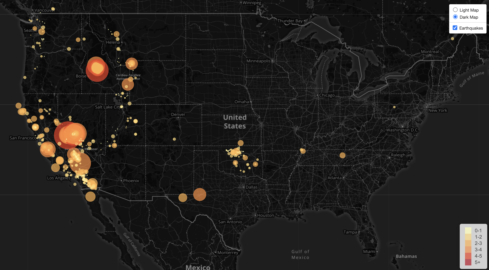

# Visualizing Data with Leaflet

* In this repo I work with JavaScript and leaflet to locate earthquakes in the past 7 days. I 
used the United States Geological Survay api and converted the data so show the earthquakes in a map.

Link:https://rolonavarro.github.io/leaflet-challenge/
